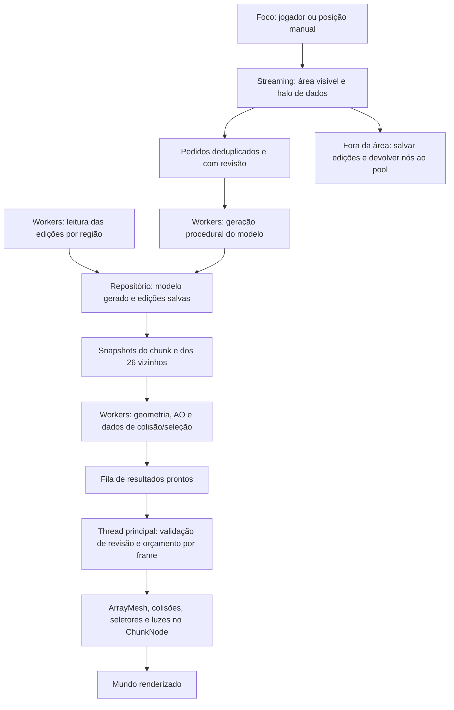

# voxelgames

Jogo voxel em desenvolvimento, feito em **Godot 4.7 com uma GDExtension em C++**. O motor gera, carrega e atualiza o mundo por chunks; GDScript cuida do personagem, menus, configurações e coordenação das interfaces. O foco atual é exploração e construção em um mundo procedural single-player.

O projeto já possui terreno editável, biomas, cavernas, vegetação, água, iluminação dinâmica, saves e inventários persistentes. O pipeline usa workers para geração de dados e geometria, com instalação dos resultados na thread principal e controle do trabalho por frame.

## Recursos implementados

### Mundo procedural

- Mundos criados por nome e seed, com seleção, carregamento e exclusão pelo menu.
- Chunks de **32 × 64 × 32 voxels**, carregados e descarregados conforme o foco se desloca.
- Streaming em uma área cilíndrica, com alcance horizontal e vertical independentes.
- Biomas configuráveis: montanhas, planícies, deserto, oceano, rio, praia, neve, oceano congelado, rio congelado e costa nevada.
- Transições de relevo e materiais entre biomas, dunas, leitos de rios, costas e superfícies congeladas.
- Raridade regional configurável por bioma e distribuição determinística pela seed.
- Camadas de superfície, solo, rocha, pedra profunda, estratos configuráveis e bedrock.
- Cavernas com túneis arredondados, curvas, ramificações e câmaras.
- Depósitos subterrâneos de ferro, carvão, diamante e bolsões de terra.
- Árvores de carvalho, palmeiras nas praias e pinheiros na neve.
- Cactos, flores, margaridas, centáureas, papoulas, grama alta, grama baixa e samambaias.

O registro atual contém **32 tipos de bloco além do ar**, incluindo os materiais naturais, troncos, folhas, madeiras, tábuas, neve, gelo e tocha. IDs existentes são mantidos para preservar a identificação dos blocos nos saves.

### Renderização e iluminação

- Remoção de faces ocultas e greedy meshing para unir faces compatíveis.
- Oclusão ambiente por vértice, considerando os vizinhos e as diagonais entre chunks.
- Superfícies opacas e transparentes separadas; plantas usam quads cruzados com recorte de transparência.
- Texturas por face em um `Texture2DArray`, com tint e metadados definidos pelo registro de blocos.
- Água com shader animado, refração e resposta ao ciclo de iluminação.
- Efeito visual de submersão ao entrar na água.
- Ciclo de dia/noite de 20 minutos por padrão: 13 minutos de dia e 7 de noite, com céu, luz ambiente, lua e neblina acompanhando o horário.
- Emissão nas inclusões coloridas de ferro e diamante, com glow discreto.
- Tochas com luz pontual quente, sombras e redução da luz/sombra pela distância.
- Reutilização de nós de chunks e preservação de luzes de tochas quando suas posições não mudam durante um rebuild.

### Personagem e interação

- Movimento em primeira pessoa, gravidade, salto, voo e modo noclip.
- Quebra e colocação de blocos por raycast, com alcance de oito blocos.
- Seleção de tochas e plantas em uma camada de colisão própria, sem bloquear o movimento do personagem.
- Coleta desses objetos para a hotbar ou o inventário; se ambos estiverem cheios, o objeto permanece no mundo.
- Sons de passos conforme o material do chão e splash ao entrar na água.
- Hotbar com seleção por teclas, roda do mouse e clique quando o mouse está livre.
- Mira, contador de FPS, pausa e tela de progresso do carregamento inicial.

A colocação usa o bloco selecionado na hotbar; atualmente não consome automaticamente a quantidade da pilha. A quebra de blocos sólidos mantém sua interação direta, enquanto plantas e tochas passam pelo fluxo de coleta descrito acima.

### Inventário e HUD

- Hotbar com **9 slots**, inventário do jogador com **27 slots** e catálogo criativo separado.
- Pilhas com limite de 99 no jogo; o núcleo permite configurar outros limites por tipo de item.
- F1 alterna entre controlar o personagem e interagir com o mouse na GUI.
- Botões independentes para abrir o inventário do jogador e o criativo.
- Janelas móveis e redimensionáveis, com posição e tamanho persistidos.
- Janelas podem permanecer abertas durante a exploração; F1 devolve o controle ao personagem.
- Grids ajustam suas colunas à largura da janela em tempo real, com mínimo de duas colunas e capacidade lógica fixa.
- Drag-and-drop com transferência, troca de pilhas e empilhamento parcial, preservando a sobra na origem.
- Cancelamento por F1, fechamento da origem, destino inválido ou cheio, com atualização da representação do item.
- Ícones, quantidades, nomes, categorias, tooltips e previews de arraste.
- Ícones de blocos gerados em CPU e armazenados em cache, com invalidação por alteração das texturas ou do registro.
- Inventários com UUIDs fixos, independentes do ciclo de vida das grids e recuperados do disco.

**O crafting anterior foi removido.** Ingredientes que estavam nos slots de craft de saves antigos são preservados em um registro de recuperação e devolvidos ao inventário quando houver espaço. Mundos novos não criam inventário de crafting.

### Menus e configurações

- Menu principal sobre uma cena voxel real, com câmera orbitando lentamente.
- Cena de fundo temporária, sem jogador e sem exigir ou criar um mundo salvo, com distância baixa de renderização.
- Criação e seleção de mundos, pausa, retorno ao menu e configurações acessíveis pelo menu ou pela pausa.
- Alcance horizontal de **4 a 30 chunks** e vertical de **2 a 6 chunks**, com sliders em passos inteiros.
- Neblina por distância e ajuste do início da neblina em passos de 5%.
- VSync, resolução e modos de janela/tela cheia.
- Antialiasing desligado, FXAA, MSAA 2×/4×; escala nativa e opções FSR 1/2 conforme o renderizador.
- Opção de SSAO e volumes separados de Master, Music e SFX.
- Persistência das configurações de áudio, vídeo, gráficos e layout das janelas.

## Controles

| Entrada | Ação |
|---|---|
| W / A / S / D | Mover o personagem |
| Mouse | Girar a câmera quando o controle está no personagem |
| Espaço | Saltar |
| Espaço duas vezes rapidamente | Alternar entre caminhada e voo |
| E / Q | Subir / descer no voo ou noclip |
| F ou Tab | Alternar noclip |
| Botão esquerdo | Quebrar bloco ou coletar objeto selecionável |
| Botão direito | Colocar o bloco selecionado |
| 1–9 ou roda do mouse | Selecionar slot da hotbar |
| F1 | Liberar o mouse para a GUI / devolver o controle ao personagem |
| Esc | Fechar as janelas de inventário abertas; fora desse contexto, alternar pausa |
| F2 | Alternar VSync |
| F5 | Salvar o mundo |

Com o mouse livre, clique no baú para abrir o inventário ou no botão criativo para abrir o catálogo. Arraste as barras de título para mover as janelas e use suas bordas para redimensionar.

## Visão geral do pipeline do motor

`VoxelAPI` coordena streaming, geração, carregamento de edições, construção de meshes, instalação e descarregamento. Pode seguir um node de foco, como o jogador, ou uma posição manual, como no menu principal.



### 1. Planejamento e streaming

O motor recalcula a área ativa quando o foco muda de chunk ou quando as distâncias são alteradas. Além da área visível, solicita um **halo de modelos vizinhos**, incluindo diagonais, para construir faces e AO nas bordas. Nem todo modelo carregado corresponde a um chunk renderizado.

Pedidos são deduplicados por posição. Cada atualização recebe uma revisão, permitindo rejeitar resultados antigos após edições ou mudanças de foco. Pedidos pendentes que saem da área são cancelados; tarefas já iniciadas são concluídas e tratadas conforme a validade de seus resultados.

### 2. Geração dos dados do mundo

O modelo do chunk é construído por passes ordenados, compartilhados como configuração imutável entre workers:

| Ordem | Pass | Responsabilidade |
|---:|---|---|
| 1 | `BiomeSelectionPass` | Amostrar clima, relevo, bioma, materiais e água por coluna |
| 2 | `TerrainSurfacePass` | Preencher superfície, solo, estratos, rocha e bedrock |
| 3 | `CaveCarvingPass` | Escavar túneis, ramificações e câmaras |
| 4 | `OreGenerationPass` | Aplicar depósitos minerais e bolsões subterrâneos |
| 5 | `WaterFillPass` | Preencher as colunas elegíveis até o nível de água |
| 6 | `TreeGenerationPass` | Gerar árvores determinísticas conforme o bioma |
| 7 | `VegetationGenerationPass` | Distribuir plantas e flores sem substituir árvores |

`TerrainSampler` fornece a mesma amostragem para geração, consultas e cálculo da posição inicial. Um cache limitado de colunas XZ reaproveita os dados entre alturas Y. Os registros são carregados antes dos jobs; workers não abrem JSON nem carregam texturas para gerar blocos ou meshes.

A leitura das regiões salvas acontece de forma assíncrona. As edições do jogador são aplicadas sobre os modelos procedurais antes da construção das meshes correspondentes.

### 3. Construção de geometria

O mesher recebe snapshots do chunk e dos 26 vizinhos em uma consulta conjunta ao repositório. Ele remove faces ocultas, une faces compatíveis, calcula AO e produz arrays de geometria, faces de colisão e posições de objetos selecionáveis/tochas. Chunks de ar dispensam a construção de mesh.

Snapshots retidos por jobs são protegidos por cópia na escrita: uma edição copia o modelo somente quando existem leitores externos. Rebuilds são solicitados pela chegada de dados, mudança de foco ou edição, incluindo os vizinhos afetados, em vez de reconstruir o mundo parado a cada frame.

### 4. Publicação e instalação

Workers publicam resultados em filas `std::deque` com seções curtas protegidas por mutex. A thread principal valida a revisão e instala os resultados: cria/envia `ArrayMesh`, configura colisões, seletores, materiais e luzes. Essas operações de integração com a cena ficam fora dos workers.

A finalização tem orçamento padrão de **2 ms por frame** e teto de **32 resultados por frame**. O tempo é conferido entre instalações; um chunk individual pode ultrapassar o orçamento. A carga inicial aguarda a região central ao redor do spawn, enquanto o restante da área continua chegando por streaming.

### 5. Controle de concorrência e ajustes

Os geradores de modelos e meshes usam a mesma implementação de scheduler, com estado próprio por etapa. O padrão é **lote de 1 chunk** e **limite de 8 chunks em execução ou aguardando consumo por etapa**. As tarefas são finitas e usam o `WorkerThreadPool` da Godot.

Depois de adicionar o mundo à árvore, o pipeline pode ser configurado por código:

```gdscript
world.set_pipeline_settings({
    "batch_size": 1,          # 1–8 chunks por tarefa
    "max_inflight": 8,        # 1–16 chunks por etapa
    "finalize_budget_ms": 2.0 # 0,1–8 ms
})
var stats: Dictionary = world.get_pipeline_stats()
```

As estatísticas expõem filas, tarefas, resultados obsoletos, tempos de geração/espera, sincronização e finalização. Lotes maiores reduzem submissões, mas podem reduzir o paralelismo com o mesmo limite de chunks. No benchmark registrado, lote 1 drenou a área mais rápido e lote 2 disponibilizou a região central mais cedo; por isso o tamanho continua configurável.

Ao trocar ou fechar um mundo, o motor aguarda os jobs, limpa o estado anterior e reutiliza os nós através do pool. Detalhes e medições estão em [Otimização do pipeline](docs/chunk_pipeline_optimization.md).

## Arquitetura do inventário

```text
GridInventory informa início do arraste e destino sob o mouse
    → InventoryDragController em GDScript resolve grids e UUIDs
    → InventoryService em C++ valida e confirma a transferência
    → inventory_changed notifica o controlador
    → as grids recebem novas representações ItemView
```

- **`InventoryService` (C++):** registro lógico de inventários, slots, limites, revisões e operações atômicas na thread principal. Recebe IDs e valores; não conhece nodes, jogador, mundo, arquivos ou metadados visuais.
- **`InventorySession` (GDScript):** define os inventários do jogo, gera UUIDs, monta ItemViews e cuida da persistência e migração dos saves.
- **`InventoryDragController` (GDScript):** associa grids aos UUIDs, valida o estado da GUI, coordena os pedidos e atualiza todas as views vinculadas.
- **`GridInventory` / `ItemView` (C++):** apresentação visual e snapshots dos itens. Alterar a apresentação não altera os dados reais.
- **`InventoryManager` (GDScript):** controle do mouse e seleção da hotbar.

Durante o arraste, o item permanece no núcleo e nos snapshots de salvamento; apenas sua representação fica escondida. Uma transferência rejeitada cancela o gesto e atualiza os campos do ItemView a partir dos dados atuais. Fechar ou destruir uma grid mantém o cadastro e seu conteúdo.

Veja [Modelo de inventário](docs/inventory_service.md) e [Interação das janelas](docs/inventory_interaction.md).

## Persistência

Os arquivos do jogador ficam no diretório `user://` da Godot:

```text
user://voxelcraft/worlds/<id>/
├── level.json               # mundo, jogador, horário e registros de inventário
└── regions/
    └── region_<x>_<y>_<z>.json # edições dos chunks agrupadas por região
```

O terreno base é regenerado pela seed e recebe as edições salvas; não é necessário salvar todos os voxels procedurais. Posição e orientação do jogador, horário e UUIDs/conteúdo dos inventários são recuperados ao carregar o mundo. A gravação final aguarda escritas assíncronas anteriores para evitar que sobrescrevam o estado mais recente.

`VoxelAPI` emite `world_opened` e `world_saving`, permitindo ao adaptador de inventário carregar e salvar mesmo sem jogador ou grids. A prévia do menu usa um mundo temporário sem persistência.

Configurações e cache de ícones também são armazenados em `user://`, separados dos saves. Mudanças nos algoritmos ou registros de geração podem alterar o terreno base de um mundo existente; as edições continuam sendo reaplicadas sobre ele.

## Compilar e executar

O projeto está configurado para Godot 4.7 e foi usado com **Godot 4.7.2**. São necessários Godot com suporte a GDExtension, Python/SCons, um compilador C++ compatível com `godot-cpp` e o submódulo inicializado.

Na raiz do repositório:

```sh
# Inicializar as dependências do repositório
git submodule update --init --recursive

# Compilar a extensão e copiá-la para project/bin/<plataforma>/
scons -j6 target=template_debug

# Importar/abrir o projeto no editor
godot --editor --path project

# Executar o jogo
godot --path project
```

Para compilar a variante de release:

```sh
scons -j6 target=template_release
```

A cena inicial é [main_menu.tscn](project/scenes/main_menu.tscn). O arquivo [example.gdextension](project/bin/example.gdextension) define os caminhos das bibliotecas. A extensão está com `reloadable = false`; reinicie o processo da Godot após recompilar o C++ para carregar a nova biblioteca.

Para gerar a base de comandos de compilação para o editor/IDE:

```sh
scons compiledb=yes
```

## Editar blocos, texturas e biomas

O plugin **Block Registry**, habilitado no editor, edita [block_registry.json](project/data/block_registry.json). Cada bloco possui ID estável, nome, categoria, texturas por face, flags e tint. **Save and Generate** atualiza o registro de runtime, o header C++ e o array de texturas.

Também é possível regenerar os assets por linha de comando e depois recompilar:

```sh
godot --headless --path project --script res://scripts/tools/rebuild_block_assets.gd
scons -j6 target=template_debug
```

Biomas, ruídos, relevo, camadas, árvores, vegetação e raridade são definidos em [biome_registry.json](project/data/biome_registry.json). O registro é validado e compartilhado como snapshot imutável; reinicie o mundo/jogo após alterar sua configuração. `VoxelAPI.validate_biome_registry()` permite validar os dados sem gerar um mundo.

Referências: [Block Registry](project/addons/block_registry/README.md), [Registro de biomas](docs/biome_registry.md) e [Cache de ícones](docs/block_icon_cache.md).

## Testes e benchmarks

[project/tests/](project/tests/) contém testes de integração da Godot para geração, biomas, streaming, iluminação, seleção de objetos, configurações, inventário, persistência e prévia do menu. [tests/](tests/) contém verificações C++ isoladas de túneis, vegetação, depósitos, transições e raridade, além de um benchmark de fila.

Exemplo de teste de integração no Linux, usando diretórios temporários para separar saves e configurações de teste dos dados do jogador:

```sh
env XDG_DATA_HOME=/tmp/voxelgames-test-data \
    XDG_CONFIG_HOME=/tmp/voxelgames-test-config \
    godot --headless --path project --script res://tests/inventory_controller_test.gd
```

Outras entradas úteis:

| Teste | Cobertura |
|---|---|
| `chunk_pipeline_test.gd` | Filas, limites, revisões, halo, rebuilds e troca de mundo |
| `chunk_pipeline_benchmark.gd` | Comparação de lotes e tempos de carregamento/drenagem |
| `biome_registry_test.gd` | Validação de configuração, sampler e geração |
| `torch_test.gd` | Luzes, seleção, coleta de plantas/tochas e persistência |
| `inventory_service_test.gd` | Núcleo lógico, limites e conservação nas transferências |
| `inventory_controller_test.gd` | Arraste, rejeição, atualização do ItemView e múltiplas views |
| `inventory_ui_test.gd` / `inventory_mouse_test.gd` | Eventos da GUI, F1 e interação |
| `inventory_reflow_test.gd` | Colunas variáveis sem alterar slots ou perder itens |
| `inventory_session_test.gd` | Migração, recuperação do antigo craft e isolamento de mundos |
| `inventory_disk_test.gd` | Escrita e leitura em processos separados; segunda execução com `-- --read` |
| `main_menu_preview_test.gd` | Mundo temporário e transições entre preview e save |
| `day_night_test.gd` / `world_time_graphics_test.gd` | Ciclo, horário salvo e opções gráficas |

Os testes headless verificam dados e comportamento; avaliações de aparência, FPS e GPU devem usar uma execução com renderização. Os resultados do benchmark existente e suas condições estão em [chunk_batch_benchmark.json](docs/chunk_batch_benchmark.json).

## Organização do repositório

| Diretório | Conteúdo |
|---|---|
| `src/` | Motor C++, GDExtension, geração, streaming, meshing, saves e núcleo de inventário |
| `project/scripts/` | Personagem, menus, configurações, apresentação e coordenação do inventário |
| `project/scenes/` | Cenas do jogo, menu, seleção/criação de mundo e HUD |
| `project/data/` | Registros de blocos e biomas |
| `project/generated/` | IDs e metadados C++ gerados a partir dos blocos |
| `project/shaders/` / `project/textures/` | Renderização, água, submersão e assets visuais |
| `project/addons/block_registry/` | Ferramenta de edição e geração dos assets de blocos |
| `project/tests/` / `tests/` | Testes de integração, algoritmos isolados e benchmarks |
| `docs/` | Notas de arquitetura, implementação e medições |
| `godot-cpp/` | Bindings da Godot usados pela extensão, como submódulo |

Documentação adicional: [Geração do mundo](docs/world_generation.md), [Seleção de objetos](docs/object_selection.md), [Dia/noite e detalhes visuais](docs/world_polish.md) e [Cavernas e depósitos](docs/underground_polish.md). Algumas notas históricas registram valores anteriores; para os parâmetros atuais, consulte o código e os registros do projeto.
